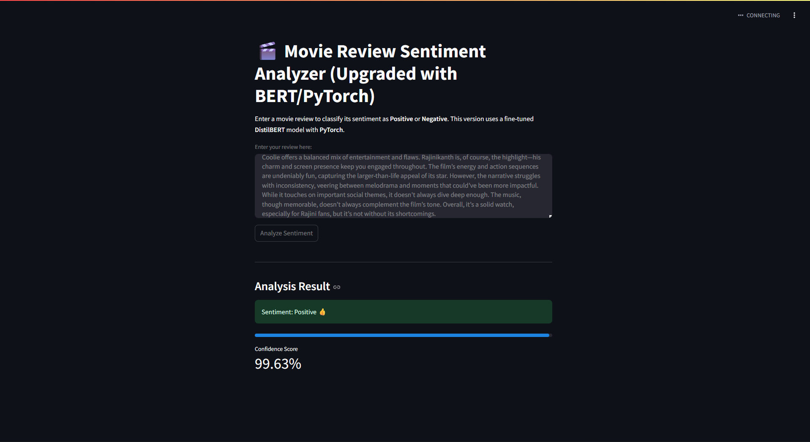

# 🎬 Sentiment-Analyzer-Transformer (BERT/PyTorch Edition)

[](https://www.python.org/downloads/)
[](https://streamlit.io)
[](https://pytorch.org)
[](https://opensource.org/licenses/MIT)

**Sentiment-Analyzer-Transformer** is an upgraded web application that analyzes the sentiment of movie reviews. This version uses a state-of-the-art **DistilBERT** model, fine-tuned using **PyTorch** and the **Hugging Face** ecosystem. It is trained on the popular IMDB 50k Movie Reviews dataset and classifies reviews as either **Positive** or **Negative** with significantly higher accuracy than the original LSTM model.

This project demonstrates a modern, end-to-end NLP workflow, from data preparation and transfer learning with Transformers to building an interactive user interface with Streamlit.

---

### ✨ Live Demo

**(You can update this link once the new app is deployed)**
**[🚀 View the Live App Here](https://sentiment-analyzer-transformer.streamlit.app/)**

### 📸 Screenshot



---

## 🌟 Features

-   **High-Accuracy Sentiment Prediction**: Leverages the power of Transformers for superior contextual understanding and accuracy.
-   **Positive/Negative Classification**: Clearly labels the sentiment of any movie review.
-   **Confidence Score**: Displays a confidence score to show how certain the model is about its prediction.
-   **Interactive UI**: A simple and clean user interface built with Streamlit.
-   **State-of-the-Art Model**: Utilizes a fine-tuned **DistilBERT** model from Hugging Face, offering higher accuracy and robustness.

---

## 🛠️ Technologies Used

-   **Machine Learning**:
    -   [PyTorch](https://pytorch.org/): For fine-tuning the transformer model.
    -   [Hugging Face `transformers`](https://huggingface.co/docs/transformers/index): For accessing the pre-trained DistilBERT model and tokenizer.
    -   [Hugging Face `datasets`](https://huggingface.co/docs/datasets/): For efficient data handling and tokenization.
    -   [Scikit-learn](https://scikit-learn.org/): For performance evaluation metrics (classification report, confusion matrix).
    -   [Pandas](https://pandas.pydata.org/) & [NumPy](https://numpy.org/): For data manipulation and numerical operations.
-   **Web Framework**:
    -   [Streamlit](https://streamlit.io/): For creating and deploying the interactive web application.
-   **Dataset**:
    -   [IMDB Dataset of 50K Movie Reviews](https://www.kaggle.com/datasets/lakshmi25npathi/imdb-dataset-of-50k-movie-reviews)

---

## 📂 Project Structure

This repository now contains both the original LSTM implementation and the upgraded Transformer version, showcasing the project's evolution.

```
sentiment_analysis/
│
├── assets/
│   ├── sentiment_distilbert_pytorch/  # The fine-tuned Hugging Face model & tokenizer
│       ├── config.json
│       ├── pytorch_model.bin
│       └── ...       # (Legacy) The Keras tokenizer
│
├── app_transformer_pytorch.py      # The Streamlit app for the new Transformer model
├── sentiment_analysis_transformer.ipynb # Jupyter Notebook for Transformer model training
├── requirements.txt     # Python dependencies for the new version
│
└── README.md                       # You are here!
```

---

## ⚙️ Setup and Installation (Transformer Version)

To run the new, upgraded project locally, please follow the steps below.

### Prerequisites

-   Python 3.9 or higher
-   `pip` package manager

### 1. Clone the Repository

```bash
git clone https://github.com/Ashish-kharde1/Sentiment-Analyzer-Transformer.git
cd Sentiment-Analyzer-Transformer
```

### 2. Create and Activate a Virtual Environment

It is highly recommended to use a virtual environment to manage project dependencies.

-   **On macOS/Linux:**
    ```bash
    python3 -m venv venv
    source venv/bin/activate
    ```
-   **On Windows:**
    ```bash
    python -m venv venv
    .\venv\Scripts\activate
    ```

### 3. Install Dependencies

Install all the necessary libraries from the new requirements file.

```bash
pip install -r requirements.txt
```

### 4. Run the Streamlit App

Now you are ready to launch the upgraded application!

```bash
streamlit run app_transformer_pytorch.py
```

Your web browser will automatically open to the application's local URL (usually `http://localhost:8501`).

---

## 🧠 Model Evolution

This project showcases an upgrade from a classic RNN to a modern Transformer-based model, a common and valuable task for an ML Engineer.

### 1. Legacy Model: LSTM

-   **Framework**: Keras / TensorFlow
-   **Architecture**: Embedding Layer -> LSTM Layer -> Dense Layer.
-   **Vocabulary Size**: Top 5,000 words.
-   **Performance**: The model achieved a test accuracy of approximately **86%**.
-   **Training Notebook**: `sentiment_analysis_lstm.ipynb`
-   **GitHub link**: `https://github.com/Ashish-kharde1/Sentiment-Analyzer-LSTM.git`

### 2. Upgraded Model: DistilBERT

-   **Framework**: PyTorch & Hugging Face
-   **Model**: Fine-tuned `distilbert-base-uncased`.
-   **Key Concept**: **Transfer learning**. Instead of training a model from scratch, we adapt a large, pre-trained model that already has a deep understanding of the English language. This results in faster training and superior performance.
-   **Performance**: The fine-tuned model achieves a test accuracy of approximately **93%**, a significant improvement.
-   **Training Notebook**: `sentiment_analysis_transformer.ipynb`

---


## 📜 License

This project is licensed under the MIT License. See the `LICENSE` file for more details.